<div align="center">
  <a id="readme-top"></a>

  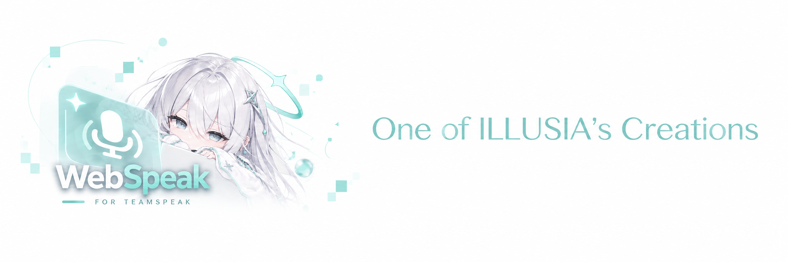

  <h1>WebSpeak</h1>

  <p><strong>让 TeamSpeak 自然地进入浏览器。</strong></p>
  <p>A self-hosted browser voice client for TeamSpeak 3 and TeamSpeak 6.</p>

  [](https://github.com/EchoSixHIYA/WebSpeak-client-for-TeamSpeak/releases/latest)
  [](https://github.com/EchoSixHIYA/WebSpeak-client-for-TeamSpeak/actions/workflows/docker-publish.yml)
  [](./LICENSE)
  [](https://github.com/EchoSixHIYA/WebSpeak-client-for-TeamSpeak/stargazers)
  <br />
  [](https://www.teamspeak.com/)
  [](https://nodejs.org/)
  [](https://vuejs.org/)
  [](https://www.typescriptlang.org/)
  [](https://github.com/users/EchoSixHIYA/packages/container/package/webspeak)
  [](https://github.com/EchoSixHIYA/WebSpeak-client-for-TeamSpeak/releases/latest)

  <p>
    <a href="#简体中文">简体中文</a> ·
    <a href="#english">English</a> ·
    <a href="#deutsch">Deutsch</a> ·
    <a href="#demo">在线 Demo</a> ·
    <a href="#community">社区 / Community</a> ·
    <a href="https://github.com/EchoSixHIYA/WebSpeak-client-for-TeamSpeak/releases/latest">下载</a>
  </p>
</div>

<details>
<summary><kbd>目录 / Table of contents</kbd></summary>

- [项目简介 · Overview](#overview)
- [在线 Demo · Live Demo](#demo)
- [社区 · Community](#community)
- [简体中文](#简体中文)
  - [界面截图](#zh-screenshots)
  - [特性](#zh-features)
  - [更新日志](#zh-changelog)
  - [部署方案](#zh-deployment)
  - [要求和注意事项](#zh-requirements)
  - [许可证](#zh-license)
- [English](#english)
  - [Screenshots](#en-screenshots)
  - [Features](#en-features)
  - [Changelog](#en-changelog)
  - [Deployment](#en-deployment)
  - [Requirements and notes](#en-requirements)
  - [License](#en-license)
- [Deutsch](#deutsch)
  - [Screenshots](#de-screenshots)
  - [Funktionen](#de-features)
  - [Änderungsprotokoll](#de-changelog)
  - [Bereitstellung](#de-deployment)
  - [Voraussetzungen und Hinweise](#de-requirements)
  - [Lizenz](#de-license)

</details>

<a id="overview"></a>

## 项目简介 · Overview

| 逻辑 | 中文 | English |
| --- | --- | --- |
| **WHAT** | WebSpeak 是一个可自行部署的 TeamSpeak 3 / TeamSpeak 6 网页客户端与语音网关。用户打开网页即可进入频道、交流和管理自己的音频设备。 | WebSpeak is a self-hosted browser client and voice gateway for TeamSpeak 3 and TeamSpeak 6. Users can join channels, communicate, and manage their audio devices directly in a browser. |
| **WHY** | 它降低了临时加入 TeamSpeak 的门槛：无需安装桌面客户端，只需分享一个网页地址，同时仍由部署者控制目标服务器、访问方式和数据。 | It lowers the barrier to joining TeamSpeak: no desktop installation is required, only a web address, while the operator keeps control of targets, access policies, and data. |
| **HOW** | 部署 WebSpeak 后，管理员在网页控制台设置默认 TeamSpeak 目标和访问策略。浏览器负责交互与音频，WebSpeak 负责连接 TeamSpeak；需要更低延迟时可启用内置 WebRTC。 | After deployment, the administrator configures the default TeamSpeak target and access policy in the web console. The browser handles interaction and audio, WebSpeak connects to TeamSpeak, and the bundled WebRTC path can be enabled for lower latency. |

<a id="demo"></a>

## 在线 Demo · Live Demo

**在线地址 / Live URL：<https://webspeak.online>**

> [!WARNING]
> **中文：** 公共演示服务器位于香港，网络和运行负载可能不稳定。延迟、断线或暂时不可用不代表自行部署后的实际表现，请勿将该节点用于重要或长期会话。
>
> **English:** The public demo is hosted in Hong Kong and its network conditions and load may be unstable. Latency, disconnections, or temporary downtime do not represent a self-hosted deployment. Do not rely on this node for important or long-running sessions.

<a id="community"></a>

## 社区 · Community

<div align="center">

<a href="http://qm.qq.com/cgi-bin/qm/qr?_wv=1027&k=yhumUMDD9PmyYFWdXWUb_x7hM5trFQY8&authKey=Pw3HBGT7GwMinTQnuFGfnpf0aRSzXOJKcAiujVP1%2BXMpjheAKrncTRivicBJxpjV&noverify=0&group_code=869500475">
  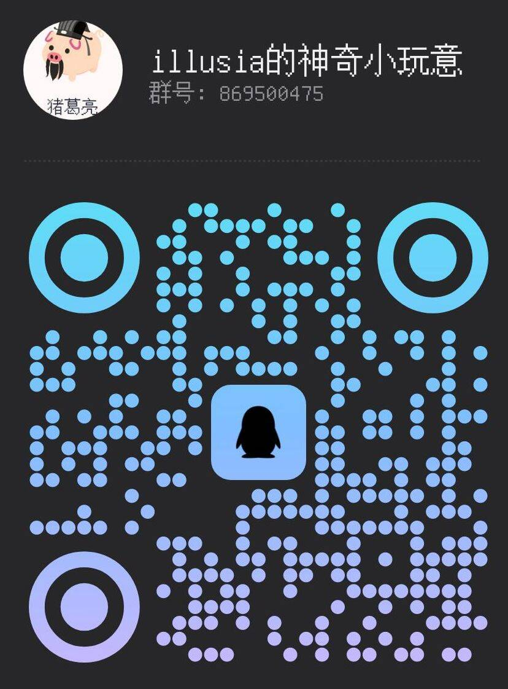
</a>

**群号 / Group ID：`869500475`**

[通过群聊链接直接加入 / Join directly through the group link](http://qm.qq.com/cgi-bin/qm/qr?_wv=1027&k=yhumUMDD9PmyYFWdXWUb_x7hM5trFQY8&authKey=Pw3HBGT7GwMinTQnuFGfnpf0aRSzXOJKcAiujVP1%2BXMpjheAKrncTRivicBJxpjV&noverify=0&group_code=869500475)

中文：在群内获取部署帮助、版本通知和使用交流。<br />
English: Join for deployment help, release announcements, and user discussion.<br />
Deutsch: Hilfe bei der Bereitstellung, Versionsankündigungen und Austausch in der Community.<br />
Telegram: [Join the Telegram group](https://t.me/+8qShpTcuN9A3MWY9)

</div>

---

<a id="简体中文"></a>

## 简体中文

WebSpeak 面向希望通过网页提供 TeamSpeak 语音服务的个人、社区和服务器管理员。它提供完整的访客页面、语音工作区和管理控制台，并可使用 Docker、预编译包或源码部署。

<a id="zh-screenshots"></a>

### 🖼️ 界面截图

以下截图来自上海测试节点，展示中文界面下的欢迎页、语音工作区、音量控制和成员操作菜单。

#### 欢迎页

<p align="center">
  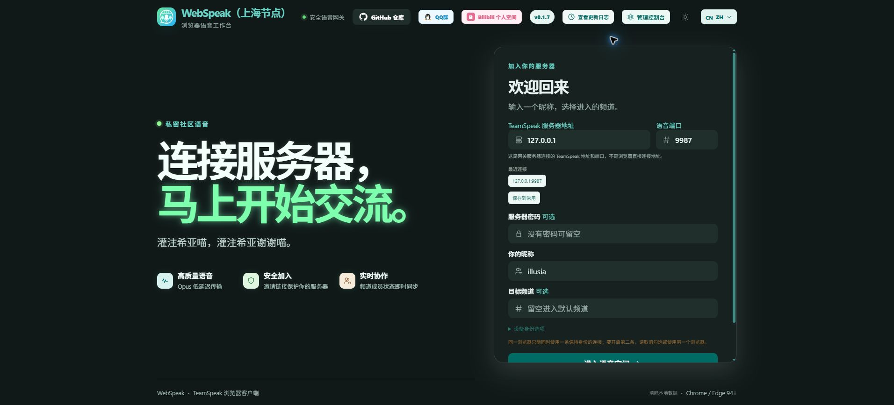
</p>

#### 语音工作区

<p align="center">
  
</p>

#### 音量控制

<p align="center">
  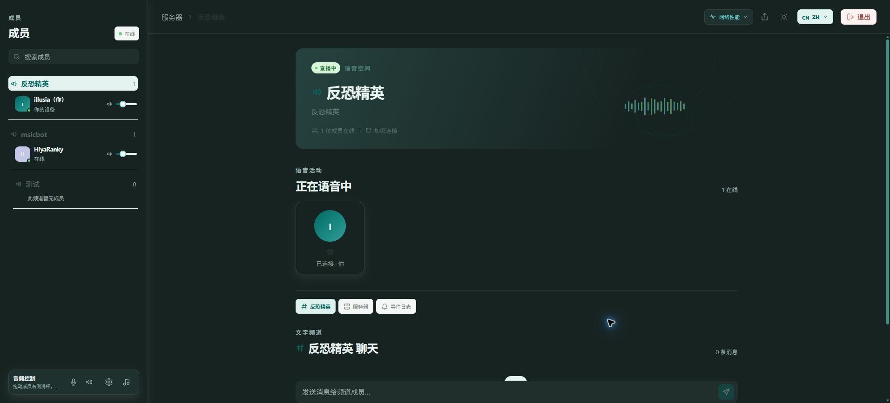
</p>

#### 成员右键菜单

<p align="center">
  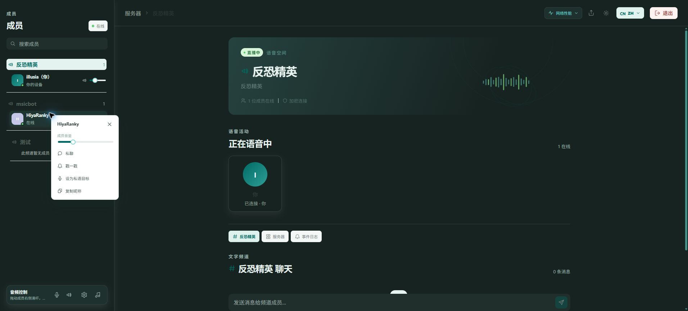
</p>

<a id="zh-features"></a>

### ✨ 特性

| 能力 | 说明 |
| --- | --- |
| TeamSpeak 兼容 | 支持 TeamSpeak 3 与 TeamSpeak 6，并自动探测目标服务器协议。 |
| 频道与成员 | 浏览完整频道树、查看各频道成员和实时状态，并可切换频道。 |
| 实时语音 | 使用 Opus 语音；支持兼容传输和可选的内置 WebRTC 低延迟传输。 |
| 音频控制 | 选择麦克风与扬声器、调节输入/输出音量、测试麦克风、闭麦、VOX，以及单独调整成员音量。 |
| 消息与互动 | 支持频道消息、服务器消息、私聊、戳一戳和耳语目标。 |
| 桌面端伴奏 | 在桌面浏览器中选择带音频的窗口或标签页，将其声音分享给当前 TeamSpeak 频道。 |
| 身份与访问 | 支持浏览器身份保持、默认目标、访客自定义目标及可撤销、可过期的邀请链接。 |
| 管理控制台 | 管理默认目标、访问策略、WebRTC、邀请链接、活动会话、连接历史、日志、诊断与数据库备份。 |
| 界面体验 | 提供中文、English 和 Deutsch 界面、浅色/深色主题，以及桌面端和移动端响应式布局。 |
| 自托管 | 数据由部署者保存；提供 Docker 镜像、Windows x64 和 Linux x64 发布包。 |

<a id="zh-changelog"></a>

### 🧾 更新日志

| 版本 | 日期 | 摘要 |
| --- | --- | --- |
| [v0.1.8](https://github.com/EchoSixHIYA/WebSpeak-client-for-TeamSpeak/releases/tag/v0.1.8) | 2026-09-08 | 简化 Docker 部署并支持连接同机 TeamSpeak；开放模式加强目标校验；SDK 增加 15 秒连接超时；网络性能面板改为每 3 秒持续监测。 |
| [v0.1.7](https://github.com/EchoSixHIYA/WebSpeak-client-for-TeamSpeak/releases/tag/v0.1.7) | 2026-09-06 | 增加德语支持、Telegram 群组入口、网络性能面板和丢包率测试；管理员测试不再创建临时客户端，并修复语言菜单留白与伴奏音量波动。 |
| [v0.1.6](https://github.com/EchoSixHIYA/WebSpeak-client-for-TeamSpeak/releases/tag/v0.1.6) | 2026-09-04 | 新增桌面端伴奏、身份保持提醒和网站图标，并修复 WebRTC 下的成员独立音量。 |
| [v0.1.5](https://github.com/EchoSixHIYA/WebSpeak-client-for-TeamSpeak/releases/tag/v0.1.5) | 2026-09-04 | 修复身份保持逻辑，优化主题切换按钮。 |
| [v0.1.4](https://github.com/EchoSixHIYA/WebSpeak-client-for-TeamSpeak/releases/tag/v0.1.4) | 2026-09-03 | 修复 WebRTC 语音和频道聊天，优化管理页、日志与移动端布局。 |
| [v0.1.3](https://github.com/EchoSixHIYA/WebSpeak-client-for-TeamSpeak/releases/tag/v0.1.3) | 2026-09-03 | 引入内置 WebRTC，迁移 TeamSpeak SDK，并改善成员同步和语音缓冲。 |
| [v0.1.2](https://github.com/EchoSixHIYA/WebSpeak-client-for-TeamSpeak/releases/tag/v0.1.2) | 2026-09-02 | 大幅改进移动端、设备选择、AudioWorklet 和响应式顶部操作。 |
| [v0.1.1](https://github.com/EchoSixHIYA/WebSpeak-client-for-TeamSpeak/releases/tag/v0.1.1) | 2026-09-02 | 完成网页客户端、管理后台、邀请链接及运维能力的首轮规范化。 |
| [v0.1.0](https://github.com/EchoSixHIYA/WebSpeak-client-for-TeamSpeak/releases/tag/v0.1.0) | 2026-08-31 | 首个规范化版本。 |

完整记录见 [CHANGELOG.md](./CHANGELOG.md)。

<a id="zh-deployment"></a>

### 🚀 部署方案

| 方案 | 适用场景 | 运行环境 |
| --- | --- | --- |
| **Docker Compose（推荐）** | 服务器长期运行、便于升级和持久化 | Docker Engine + Docker Compose |
| **发布包** | 不希望安装 Node.js 或构建依赖 | Windows x64 或 Linux x64 |
| **源码运行** | 开发、调试或二次开发 | Node.js 22.5+、Git 与本地编译工具 |

#### Docker Compose（推荐）

```bash
git clone --depth 1 https://github.com/EchoSixHIYA/WebSpeak-client-for-TeamSpeak.git
cd WebSpeak-client-for-TeamSpeak
docker compose pull
docker compose up -d
```

启动后访问 `http://<你的主机>:3040`。如使用反向代理，将上游设置为 `http://<你的主机>:3040`；启用 WebRTC 时，放行管理后台显示的 UDP 端口范围。数据保存在 Docker volume `webspeak-data`。查看状态：

```bash
docker compose ps
docker compose logs -f webspeak
```

升级：

```bash
git pull --ff-only
docker compose pull
docker compose up -d
```

不要执行 `docker compose down -v`，否则会删除数据库、管理员设置和其他持久化数据。

#### Windows / Linux 发布包

1. 从 [GitHub Releases](https://github.com/EchoSixHIYA/WebSpeak-client-for-TeamSpeak/releases/latest) 下载对应的 `windows-x64.zip` 或 `linux-x64.tar.gz`。
2. 解压到独立目录。
3. Windows 运行 `start-webspeak.cmd`；Linux 运行 `./start-webspeak.sh`。
4. 发布包自带 Node.js 运行时和生产依赖，无需再次执行 `npm install`。

#### 源码运行

```bash
git clone https://github.com/EchoSixHIYA/WebSpeak-client-for-TeamSpeak.git
cd WebSpeak-client-for-TeamSpeak
npm ci --ignore-scripts
npm run prepare:sdk
npm rebuild @discordjs/opus --foreground-scripts
npm --prefix web ci
npm --prefix web run build
npm run build
npm start
```

源码构建 `@discordjs/opus` 时需要 Python、Make 和 C/C++ 编译工具。开发模式可分别使用 `npm run dev` 与 `npm run web:dev`。

#### 首次配置（所有方案）

1. 打开 `http://<你的主机>:3040/admin`。
2. 使用默认账号 `admin`、默认密码 `admin` 登录，并按提示立即设置至少 12 位的新密码。
3. 在“服务器”页填写默认 TeamSpeak 目标和访问方式；目标可写为 `voice.example.com#9987`。
4. 公网使用时为站点配置 HTTPS。若启用 WebRTC，还需放行管理后台显示的 UDP 端口范围。

<a id="zh-requirements"></a>

### ⚠️ 要求和注意事项

| 项目 | 要求或注意事项 |
| --- | --- |
| 浏览器 | 建议使用最新版 Chrome、Edge 或其他支持 WebRTC 的现代浏览器。麦克风和屏幕音频通常要求 HTTPS 安全上下文。 |
| TeamSpeak 网络 | WebSpeak 主机必须能够访问目标 TeamSpeak 服务器。目标默认语音端口为 `9987`，也可在网页中填写其他端口。 |
| Web 服务网络 | 服务使用 `3040/TCP`。公网部署建议通过 HTTPS 反向代理提供网页和 WebSocket。 |
| WebRTC | 默认使用 `40000–40099/UDP`，请在云安全组和主机防火墙中放行。自定义范围时同步放行对应端口；启用 WebRTC 后需先关闭它才能修改端口范围。 |
| 身份保持 | 同一浏览器身份同时只能保持一条活动连接。需要并行连接时，请取消第二条连接的“保持身份”，或使用另一个浏览器/浏览器配置文件。 |
| 伴奏 | 仅桌面端提供，并要求启用 WebRTC。选择窗口或标签页时必须同时勾选共享音频；浏览器无法直接任意读取本地应用音频。 |
| 数据 | Docker 数据位于 `webspeak-data` volume；发布包和源码运行的数据位于程序目录的 `data/`。升级或迁移前建议从管理后台导出数据库备份。 |
| 会话上限 | 单实例最多允许 100 个活动网页会话。 |
| 项目关系 | WebSpeak 是社区项目，不是 TeamSpeak 官方产品；TeamSpeak 名称及商标归其权利人所有。 |

<a id="zh-license"></a>

### 📜 许可证

WebSpeak 使用 [GNU Affero General Public License v3.0 only](./LICENSE) 发布。你可以使用、研究、修改和再分发本项目；如果修改后的版本通过网络向用户提供服务，需要按照 AGPL-3.0 向这些用户提供对应源代码。

<div align="right"><a href="#readme-top">返回顶部 ↑</a></div>

---

<a id="english"></a>

## English

WebSpeak is built for individuals, communities, and server operators who want to offer TeamSpeak voice access through the web. It includes a complete visitor page, voice workspace, and administration console, with Docker, prebuilt-package, and source deployment options.

<a id="en-screenshots"></a>

### 🖼️ Screenshots

These screenshots come from the Shanghai test node and show the welcome page, voice workspace, audio controls, and member actions in English.

#### Welcome page

<p align="center">
  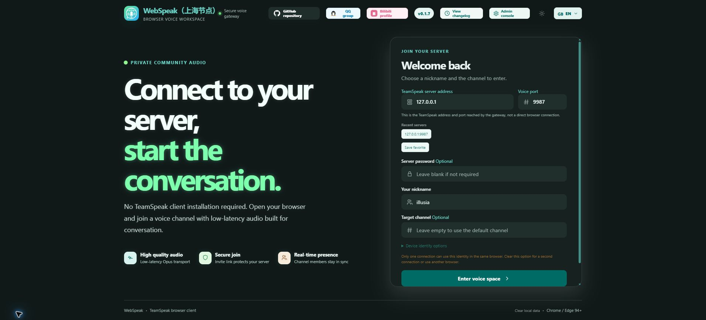
</p>

#### Voice workspace

<p align="center">
  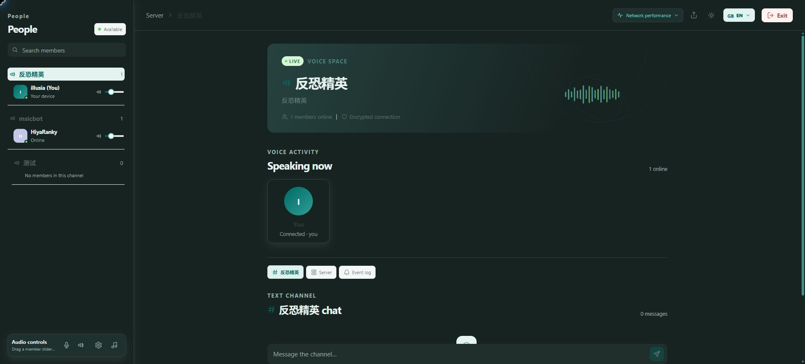
</p>

#### Audio controls

<p align="center">
  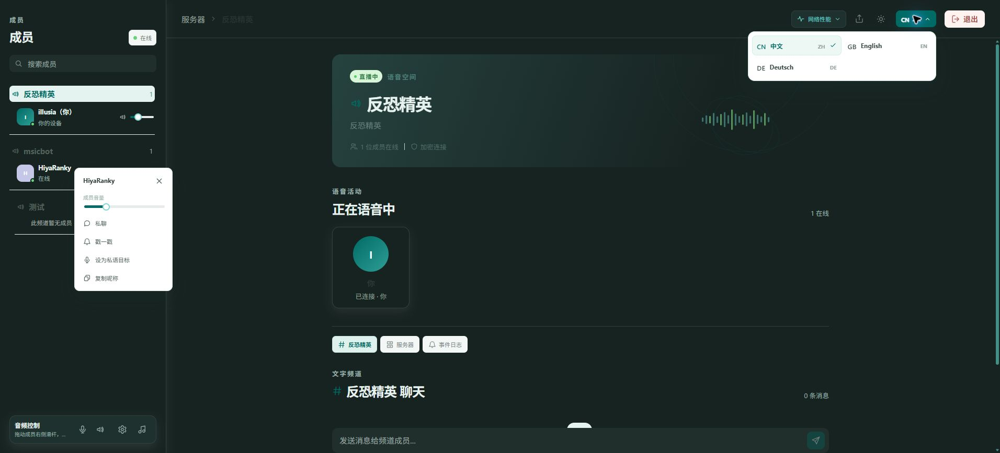
</p>

#### Member context menu

<p align="center">
  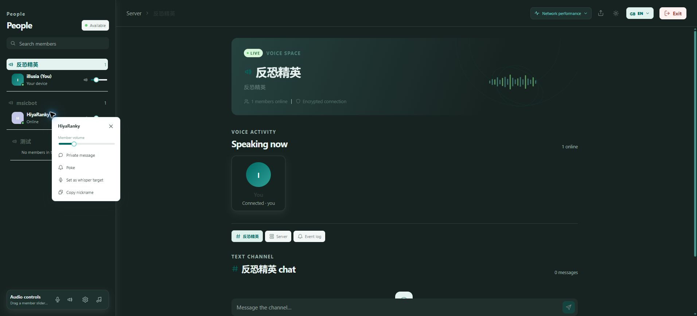
</p>

<a id="en-features"></a>

### ✨ Features

| Capability | Description |
| --- | --- |
| TeamSpeak compatibility | Supports TeamSpeak 3 and TeamSpeak 6 and automatically detects the target server protocol. |
| Channels and members | Browse the complete channel tree, see members and live states in each channel, and switch channels. |
| Realtime voice | Uses Opus audio with a compatibility transport and an optional bundled WebRTC low-latency transport. |
| Audio controls | Select microphones and speakers, adjust input/output volume, test the microphone, mute, use VOX, and control each member's volume. |
| Messaging and actions | Supports channel chat, server chat, private messages, poke actions, and whisper targets. |
| Desktop accompaniment | Select an audio-enabled window or browser tab on desktop and share its sound with the current TeamSpeak channel. |
| Identity and access | Supports remembered browser identities, a default target, visitor-defined targets, and revocable expiring invite links. |
| Administration | Manage the default target, access policy, WebRTC, invites, active sessions, connection history, logs, diagnostics, and database backups. |
| User experience | Chinese, English, and German interfaces, light/dark themes, and responsive desktop/mobile layouts. |
| Self-hosting | Data stays with the operator; Docker images and Windows x64 / Linux x64 packages are provided. |

<a id="en-changelog"></a>

### 🧾 Changelog

| Version | Date | Summary |
| --- | --- | --- |
| [v0.1.8](https://github.com/EchoSixHIYA/WebSpeak-client-for-TeamSpeak/releases/tag/v0.1.8) | 2026-09-08 | Simplified Docker deployment for local TeamSpeak targets; hardened open-target validation; added a 15-second SDK connection timeout; network metrics now refresh every 3 seconds. |
| [v0.1.7](https://github.com/EchoSixHIYA/WebSpeak-client-for-TeamSpeak/releases/tag/v0.1.7) | 2026-09-06 | Added German support, a Telegram community link, network performance and packet-loss checks; admin tests no longer create temporary clients, and language-menu spacing and accompaniment volume fluctuations were fixed. |
| [v0.1.6](https://github.com/EchoSixHIYA/WebSpeak-client-for-TeamSpeak/releases/tag/v0.1.6) | 2026-09-04 | Added desktop accompaniment, remembered-identity guidance, and the site icon; fixed per-member volume under WebRTC. |
| [v0.1.5](https://github.com/EchoSixHIYA/WebSpeak-client-for-TeamSpeak/releases/tag/v0.1.5) | 2026-09-04 | Fixed identity persistence and refined the theme switch. |
| [v0.1.4](https://github.com/EchoSixHIYA/WebSpeak-client-for-TeamSpeak/releases/tag/v0.1.4) | 2026-09-03 | Fixed WebRTC voice and channel chat; improved administration, logs, and mobile layouts. |
| [v0.1.3](https://github.com/EchoSixHIYA/WebSpeak-client-for-TeamSpeak/releases/tag/v0.1.3) | 2026-09-03 | Added bundled WebRTC, migrated the TeamSpeak SDK, and improved member sync and voice buffering. |
| [v0.1.2](https://github.com/EchoSixHIYA/WebSpeak-client-for-TeamSpeak/releases/tag/v0.1.2) | 2026-09-02 | Major mobile, device-selection, AudioWorklet, and responsive-header improvements. |
| [v0.1.1](https://github.com/EchoSixHIYA/WebSpeak-client-for-TeamSpeak/releases/tag/v0.1.1) | 2026-09-02 | First normalized browser client, admin console, invite, and operations feature set. |
| [v0.1.0](https://github.com/EchoSixHIYA/WebSpeak-client-for-TeamSpeak/releases/tag/v0.1.0) | 2026-08-31 | First normalized release. |

See [CHANGELOG.md](./CHANGELOG.md) for the complete history.

<a id="en-deployment"></a>

### 🚀 Deployment

| Method | Best for | Runtime |
| --- | --- | --- |
| **Docker Compose (recommended)** | Long-running servers, simple upgrades, and persistent data | Docker Engine + Docker Compose |
| **Release packages** | Running without installing Node.js or build dependencies | Windows x64 or Linux x64 |
| **From source** | Development, debugging, and customization | Node.js 22.5+, Git, and native build tools |

#### Docker Compose (recommended)

```bash
git clone --depth 1 https://github.com/EchoSixHIYA/WebSpeak-client-for-TeamSpeak.git
cd WebSpeak-client-for-TeamSpeak
docker compose pull
docker compose up -d
```

After startup, open `http://<your-host>:3040`. If you use a reverse proxy, set its upstream to `http://<your-host>:3040`. When WebRTC is enabled, allow the UDP range shown in the administration console. Persistent data is stored in the `webspeak-data` Docker volume. Check the service with:

```bash
docker compose ps
docker compose logs -f webspeak
```

Upgrade with:

```bash
git pull --ff-only
docker compose pull
docker compose up -d
```

Do not run `docker compose down -v`; it removes the database, administrator settings, and other persistent data.

#### Windows / Linux release packages

1. Download the matching `windows-x64.zip` or `linux-x64.tar.gz` from [GitHub Releases](https://github.com/EchoSixHIYA/WebSpeak-client-for-TeamSpeak/releases/latest).
2. Extract it into a dedicated directory.
3. Run `start-webspeak.cmd` on Windows or `./start-webspeak.sh` on Linux.
4. Release packages include the Node.js runtime and production dependencies; do not run `npm install` inside them.

#### Run from source

```bash
git clone https://github.com/EchoSixHIYA/WebSpeak-client-for-TeamSpeak.git
cd WebSpeak-client-for-TeamSpeak
npm ci --ignore-scripts
npm run prepare:sdk
npm rebuild @discordjs/opus --foreground-scripts
npm --prefix web ci
npm --prefix web run build
npm run build
npm start
```

Building `@discordjs/opus` requires Python, Make, and a C/C++ toolchain. For development, run `npm run dev` and `npm run web:dev` separately.

#### First-time setup (all methods)

1. Open `http://<your-host>:3040/admin`.
2. Sign in with the default username `admin` and password `admin`, then immediately set a new password of at least 12 characters as prompted.
3. Configure the default TeamSpeak target and access mode on the **Servers** page. A target can be written as `voice.example.com#9987`.
4. Configure HTTPS for public access. If WebRTC is enabled, also allow the UDP range shown in the administration console.

<a id="en-requirements"></a>

### ⚠️ Requirements and notes

| Area | Requirement or note |
| --- | --- |
| Browser | Use a current Chrome, Edge, or another modern browser with WebRTC support. Microphone and shared-screen audio normally require an HTTPS secure context. |
| TeamSpeak network | The WebSpeak host must be able to reach the target TeamSpeak server. The default voice port is `9987`, and other ports can be entered in the web interface. |
| Web network | The service uses `3040/TCP`. Public deployments should expose the page and WebSocket through an HTTPS reverse proxy. |
| WebRTC | The default range is `40000–40099/UDP`; allow it in the cloud security group and host firewall. For a custom range, allow the corresponding ports. Disable WebRTC before changing the range. |
| Remembered identity | One browser identity can hold only one active remembered connection at a time. For parallel connections, disable **Remember identity** on the second connection or use another browser/profile. |
| Accompaniment | Desktop only and requires WebRTC. When selecting a window or tab, enable audio sharing as well. Browsers cannot arbitrarily capture every local application's audio. |
| Data | Docker data is stored in the `webspeak-data` volume. Release packages and source installs store data in the program directory's `data/` folder. Export a database backup from the admin console before upgrades or migration. |
| Session limit | One instance accepts up to 100 active browser sessions. |
| Project relationship | WebSpeak is a community project and is not an official TeamSpeak product. TeamSpeak names and trademarks belong to their respective owners. |

<a id="en-license"></a>

### 📜 License

WebSpeak is released under the [GNU Affero General Public License v3.0 only](./LICENSE). You may use, study, modify, and redistribute the project. If a modified version is made available to users over a network, the corresponding source code must be offered to those users under AGPL-3.0.

<div align="right"><a href="#readme-top">Back to top ↑</a></div>

---

<a id="deutsch"></a>

## Deutsch

WebSpeak ist ein selbst gehosteter TeamSpeak-3-/TeamSpeak-6-Webclient und ein Sprach-Gateway. Nutzer können direkt im Browser Kanälen beitreten, sprechen und chatten; Administratoren verwalten Zielserver und Zugriff über die Webkonsole.

<a id="de-screenshots"></a>

### 🖼️ Screenshots

Diese Screenshots stammen vom Shanghai-Testknoten und zeigen die Willkommensseite, den Sprachbereich, die Audiosteuerung und das Mitglieder-Menü auf Deutsch.

#### Willkommensseite

<p align="center">
  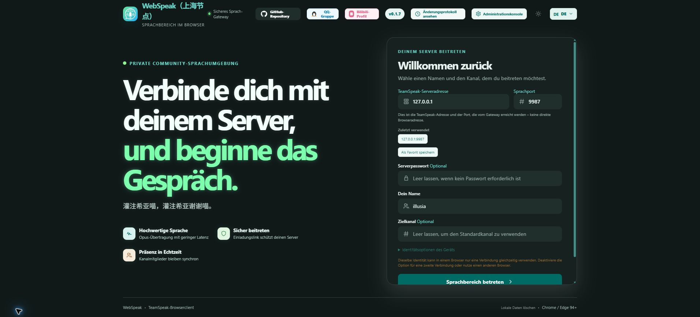
</p>

#### Sprachbereich

<p align="center">
  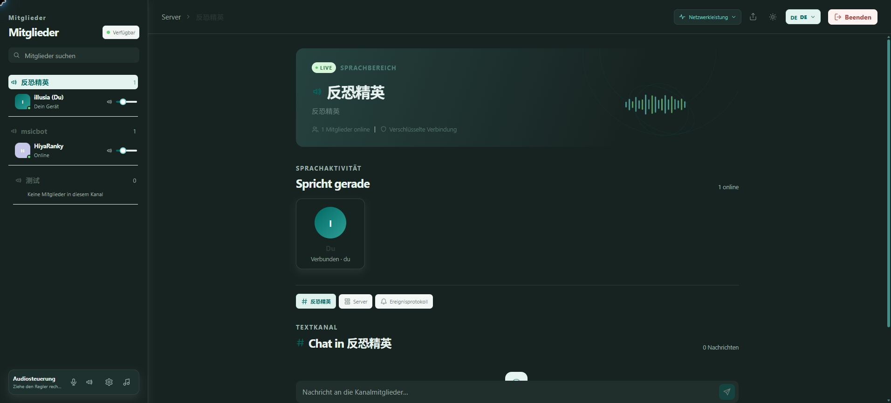
</p>

#### Audiosteuerung

<p align="center">
  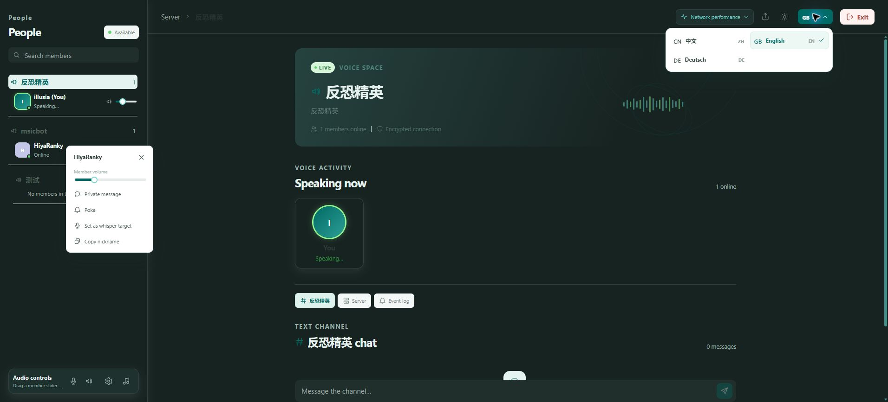
</p>

#### Mitglieder-Menü

<p align="center">
  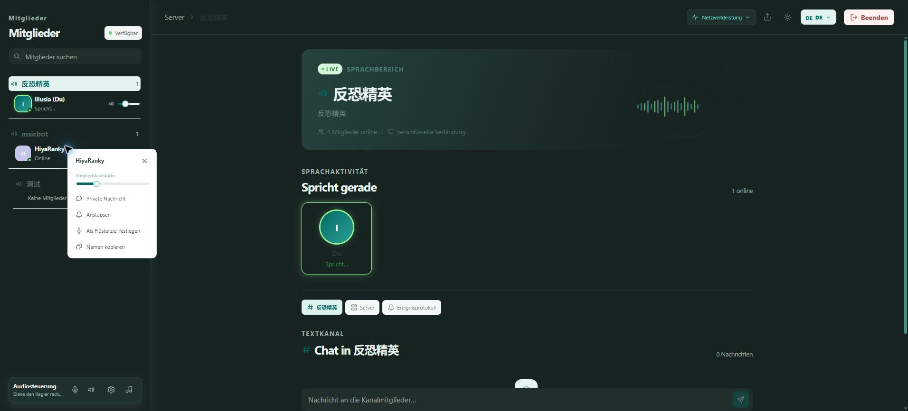
</p>

<a id="de-features"></a>

### ✨ Funktionen

| Funktion | Beschreibung |
| --- | --- |
| TeamSpeak-Kompatibilität | Unterstützt TeamSpeak 3 und TeamSpeak 6 und erkennt das Protokoll des Zielservers automatisch. |
| Kanäle und Mitglieder | Zeigt die Kanalstruktur, Mitglieder und ihren aktuellen Status an. |
| Echtzeit-Sprache | Opus-Audio mit kompatiblem Transport und optionalem integriertem WebRTC für geringere Latenz. |
| Audiosteuerung | Mikrofon und Lautsprecher auswählen, Lautstärke anpassen, testen und einzelne Mitglieder regeln. |
| Nachrichten und Interaktion | Kanal- und Serverchat, private Nachrichten, Anstupsen und Flüsterziele. |
| Begleitton auf dem Desktop | Audio eines freigegebenen Fensters oder Browser-Tabs mit dem TeamSpeak-Kanal teilen. |
| Identität und Zugriff | Geräteidentität speichern, Standardziele verwalten, eigene Ziele erlauben und zeitlich begrenzte Einladungen erstellen. |
| Administrationskonsole | Ziele, Zugriff, WebRTC, Sitzungen, Verbindungen, Protokolle, Diagnosen und Datenbanksicherungen verwalten. |
| Responsive Oberfläche | Deutsche, englische und chinesische Oberfläche, helle/dunkle Designs sowie Desktop- und Mobilansicht. |
| Selbst gehostet | Die Daten bleiben beim Betreiber; Docker-, Windows-x64- und Linux-x64-Pakete sind verfügbar. |

<a id="de-changelog"></a>

### 🧾 Änderungsprotokoll

| Version | Datum | Zusammenfassung |
| --- | --- | --- |
| [v0.1.8](https://github.com/EchoSixHIYA/WebSpeak-client-for-TeamSpeak/releases/tag/v0.1.8) | 2026-09-08 | Docker-Bereitstellung für lokale TeamSpeak-Ziele vereinfacht; Zielprüfung im offenen Modus gehärtet; 15-Sekunden-Timeout für SDK-Verbindungen ergänzt; Netzwerkmetriken werden alle 3 Sekunden aktualisiert. |
| [v0.1.7](https://github.com/EchoSixHIYA/WebSpeak-client-for-TeamSpeak/releases/tag/v0.1.7) | 2026-09-06 | Deutsche Oberfläche, Telegram-Link sowie Netzwerk- und Paketverlustprüfung hinzugefügt; Admin-Tests erzeugen keine temporären Clients mehr, außerdem wurden Sprachmenü-Leerraum und Begleitton-Schwankungen behoben. |
| [v0.1.6](https://github.com/EchoSixHIYA/WebSpeak-client-for-TeamSpeak/releases/tag/v0.1.6) | 2026-09-04 | Desktop-Begleitton, Hinweise zur Identität und Website-Symbol hinzugefügt; individuelle Lautstärke unter WebRTC korrigiert. |
| [v0.1.5](https://github.com/EchoSixHIYA/WebSpeak-client-for-TeamSpeak/releases/tag/v0.1.5) | 2026-09-04 | Identitätsspeicherung korrigiert und Designumschaltung verbessert. |
| [v0.1.4](https://github.com/EchoSixHIYA/WebSpeak-client-for-TeamSpeak/releases/tag/v0.1.4) | 2026-09-03 | WebRTC und Kanalchat korrigiert; Administrationsseite, Protokolle und Mobilansicht verbessert. |
| [v0.1.3](https://github.com/EchoSixHIYA/WebSpeak-client-for-TeamSpeak/releases/tag/v0.1.3) | 2026-09-03 | Integriertes WebRTC, aktualisiertes TeamSpeak-SDK und bessere Mitgliedersynchronisierung. |

Vollständige Historie: [CHANGELOG.md](./CHANGELOG.md).

<a id="de-deployment"></a>

### 🚀 Bereitstellung

| Methode | Geeignet für | Umgebung |
| --- | --- | --- |
| **Docker Compose (empfohlen)** | Dauerbetrieb, einfache Updates und persistente Daten | Docker Engine + Docker Compose |
| **Release-Paket** | Betrieb ohne Node.js und Build-Werkzeuge | Windows x64 oder Linux x64 |
| **Aus dem Quellcode** | Entwicklung und Anpassungen | Node.js 22.5+, Git und native Build-Werkzeuge |

#### Docker Compose

```bash
git clone --depth 1 https://github.com/EchoSixHIYA/WebSpeak-client-for-TeamSpeak.git
cd WebSpeak-client-for-TeamSpeak
docker compose pull
docker compose up -d
```

Nach dem Start ist WebSpeak unter `http://<dein-host>:3040` erreichbar. Bei einem Reverse Proxy muss das Upstream-Ziel `http://<dein-host>:3040` sein. Für WebRTC muss der im Adminbereich angezeigte UDP-Portbereich freigegeben werden. Die persistenten Daten liegen im Docker-Volume `webspeak-data`.

#### Release-Pakete

Lade das passende Paket von [GitHub Releases](https://github.com/EchoSixHIYA/WebSpeak-client-for-TeamSpeak/releases/latest), entpacke es in ein eigenes Verzeichnis und starte unter Windows `start-webspeak.cmd` bzw. unter Linux `./start-webspeak.sh`.

#### Erste Konfiguration

Öffne `/admin`, melde dich zunächst mit `admin` / `admin` an und ändere das Passwort. Konfiguriere anschließend das Standard-TeamSpeak-Ziel und die gewünschte Zugriffsmethode.

<a id="de-requirements"></a>

### ⚠️ Voraussetzungen und Hinweise

| Bereich | Hinweis |
| --- | --- |
| Browser | Aktuelles Chrome, Edge oder ein moderner WebRTC-fähiger Browser wird empfohlen. Für Mikrofon- und Bildschirm-Audio ist normalerweise HTTPS erforderlich. |
| TeamSpeak-Netzwerk | Der WebSpeak-Host muss den Zielserver erreichen können. Der Standard-Sprachport ist `9987`; andere Ports können im Webinterface eingetragen werden. |
| WebRTC | Der Standardbereich ist `40000–40099/UDP`; Firewall und Sicherheitsgruppe müssen den gesamten Bereich erlauben. Bei einem benutzerdefinierten Bereich sind die entsprechenden Ports freizugeben. |
| Gespeicherte Identität | Eine Browseridentität kann nur eine aktive gespeicherte Verbindung gleichzeitig halten. Für parallele Verbindungen die Option deaktivieren oder ein anderes Browserprofil verwenden. |
| Begleitton | Nur auf Desktop-Browsern verfügbar und WebRTC erforderlich. Bei der Freigabe eines Fensters oder Tabs muss auch Audio freigegeben werden. |
| Selbsthosting | WebSpeak ist kein offizielles TeamSpeak-Produkt. Namen und Marken gehören den jeweiligen Rechteinhabern. |

<a id="de-license"></a>

### 📜 Lizenz

WebSpeak wird unter der [GNU Affero General Public License v3.0 only](./LICENSE) veröffentlicht. Bei Bereitstellung einer veränderten Version über ein Netzwerk muss der entsprechende Quellcode den Nutzern unter AGPL-3.0 angeboten werden.

<div align="right"><a href="#readme-top">Nach oben ↑</a></div>
